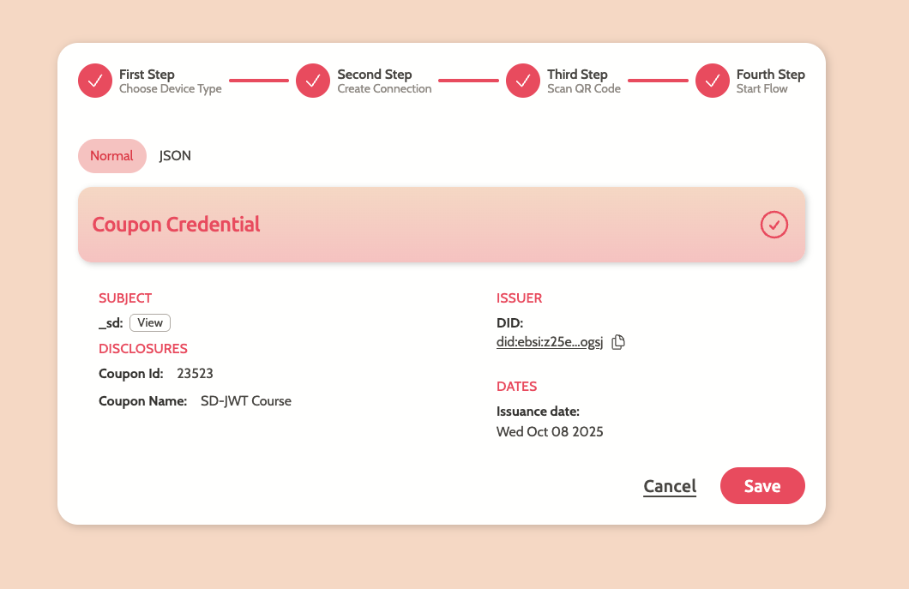

# EduCTX Integration: Bringing SD-JWT to Educational Credentials

**Blockchain Lab:UM**

*Following our previous post on SD-JWT integration in Masca, we're excited to announce the next milestone: seamless SD-JWT support with the EduCTX issuer platform. This integration represents a significant step forward in privacy-preserving educational credential management.*

---

## Building on Our SD-JWT Foundation

In our previous blog post, we introduced how Masca now supports SD-JWT (Selective Disclosure JSON Web Token) for privacy-preserving credential sharing. We demonstrated how users can selectively disclose only the necessary claims from their credentials while keeping sensitive information private.

Today, we're taking this capability to the next level by integrating SD-JWT support with the EduCTX issuer platform, enabling educational institutions to issue privacy-preserving credentials that students can selectively share.

## What is EduCTX?

EduCTX is a blockchain-based platform designed for issuing and managing educational credentials. It provides institutions with the tools to create, issue, and verify academic credentials in a decentralized manner, ensuring authenticity and preventing fraud.

## The Integration: SD-JWT Meets Educational Credentials

Our integration with EduCTX brings selective disclosure capabilities to educational credentials, allowing students to share only the specific information they want to reveal. This is particularly valuable in scenarios such as:

- **Job Applications**: Students can prove they have a degree without revealing their GPA
- **Age Verification**: Confirming age for certain services without exposing birth date
- **Qualification Sharing**: Demonstrating specific skills or certifications without disclosing personal details
- **Academic Progress**: Showing completion of courses without revealing grades

## How It Works: The Complete Flow

### Step 1: Credential Issuance on EduCTX

The process begins when an educational institution issues an SD-JWT-based credential through the EduCTX platform. The issuer creates a credential with selective disclosure capabilities, where sensitive claims are hashed and can be selectively revealed by the holder.

*Educational institutions can now issue SD-JWT credentials directly through the EduCTX platform, ensuring that students receive privacy-preserving credentials from the moment of issuance.*

### Step 2: QR Code Generation and Email Delivery

Once the credential is issued, the system generates a QR code that contains the necessary information for the student to claim their credential. This QR code is sent via email, providing a secure and convenient way for students to access their credentials.

*Students receive their credential claim information via email, including a QR code that facilitates the secure transfer of their SD-JWT credential to their wallet.*

### Step 3: Secure Authentication Process

To ensure the security of the credential transfer, students must authenticate using a ping code sent to their email. This two-factor authentication process adds an extra layer of security to the credential claiming process.

*The authentication process requires students to enter a ping code received via email, ensuring that only the intended recipient can claim the credential.*

### Step 4: Credential Storage in Masca

After successful authentication, the SD-JWT credential is securely transferred to the student's Masca wallet. The credential is stored with all its selective disclosure capabilities intact, ready for future use.

*The SD-JWT credential is now safely stored in the student's Masca wallet, where they can selectively disclose claims as needed for various verification scenarios.*

## Technical Implementation

The integration leverages the same OpenWallet Foundation's sd-jwt-js library that powers Masca's SD-JWT capabilities. This ensures consistency and compatibility across the entire ecosystem.

Key technical features include:

- **Seamless Integration**: The EduCTX platform now natively supports SD-JWT credential issuance
- **Secure Transfer**: QR code-based credential transfer with email authentication
- **Privacy by Design**: All credentials are issued with selective disclosure capabilities from the start
- **Cross-Platform Compatibility**: Credentials work seamlessly between EduCTX and Masca

## Real-World Impact

This integration has significant implications for the educational sector:

### For Students
- **Enhanced Privacy**: Students can share only the information they want to reveal
- **Reduced Data Exposure**: No need to share complete academic records for simple verifications
- **Better Control**: Students maintain full control over their credential data

### For Educational Institutions
- **Modern Credentialing**: Institutions can offer cutting-edge privacy-preserving credentials
- **Reduced Administrative Burden**: Automated credential issuance and verification
- **Enhanced Security**: Blockchain-based credentials are tamper-proof and verifiable

### For Verifiers (Employers, Service Providers)
- **Focused Verification**: Receive only the specific information needed for verification
- **Trusted Credentials**: Blockchain-based verification ensures authenticity
- **Streamlined Process**: Faster verification with reduced data handling

## Looking Ahead: The Future of Educational Credentials

This integration represents just the beginning of our vision for privacy-preserving educational credentials. Future developments may include:

- **Advanced Selective Disclosure**: More granular control over what information is shared
- **Cross-Institutional Credentials**: Credentials that can be verified across different educational platforms
- **Automated Verification**: Integration with recruitment platforms for seamless credential verification
- **International Standards**: Alignment with emerging global standards for educational credentials

## Try It Today

Students and educational institutions can now experience the power of SD-JWT credentials through the EduCTX platform. The integration is live and ready for use, providing a glimpse into the future of privacy-preserving educational credential management.

## Conclusion

The integration of SD-JWT with the EduCTX issuer platform marks a significant milestone in our journey toward privacy-preserving credential management. By combining the power of selective disclosure with educational credentials, we're not just improving the technical capabilities of the system—we're fundamentally changing how students interact with their academic achievements.

This integration demonstrates our commitment to building a more privacy-focused, user-controlled digital identity ecosystem. As we continue to expand SD-JWT support across different platforms and use cases, we're creating a foundation for a more secure, private, and user-centric approach to digital credentials.

The future of educational credentials is here, and it's built on the principles of privacy, control, and selective disclosure. Welcome to the next generation of academic credential management.

---

*For more information about Masca and our SD-JWT implementation, check out our previous blog post and visit the Masca DApp to experience selective disclosure in action.*
